# Layer Activity Guide

This document serves as the "Instruction Manual" for the project's Domain-Driven architecture. It defines the specific responsibility of each file type within a domain folder (`src/domains/{entity}/`) and how data flows between them.

## The 4-Layer Architecture

For any game entity (e.g., Bulldozer, Plow, Gem), the implementation is split into four distinct layers.

### 1. Generation Layer (`pipeline/generator.py`)
*   **Context**: Build-Time (Blender / Python).
*   **Activity**: **Procedural Modeling**.
*   **Responsibility**:
    *   Constructs the 3D geometry (vertices, faces, UVs).
    *   Defines the "Contract" by tagging objects and materials with `damp_id`.
    *   Exports the binary artifact (GLB) to `assets/models/`.
*   **Inputs**: None (or pure math parameters).
*   **Outputs**: `.glb` file, `damp_id` tags.

### 2. Texture Layer (`pipeline/texture.py`)
*   **Context**: Build-Time (Python / Pillow).
*   **Activity**: **Procedural Texturing**.
*   **Responsibility**:
    *   Generates 2D image assets (PNGs) for diffuse maps, normal maps, masks, etc.
    *   Exports to `assets/textures/`.
*   **Inputs**: None.
*   **Outputs**: `.png` files used by the Configuration Layer.

### 3. Configuration Layer (`config.json`)
*   **Context**: Static Data (JSON).
*   **Activity**: **Tuning & Definition**.
*   **Responsibility**:
    *   Maps `damp_id` tags (from Layer 1) to concrete visual properties.
    *   **Links textures** (from Layer 2) to materials.
    *   **Material Presets**: Can reference global presets (e.g., "Glass", "YellowMetallic") defined in `src/core/material-manager.js` to ensure consistent art direction.
    *   Defines static assembly offsets (e.g., "Left track is at x: -1.5").
*   **Inputs**: `damp_id` tags, Texture filenames.
*   **Outputs**: JSON object loaded at runtime.

### 4. Simulation Layer (`logic.js`)
*   **Context**: Runtime (Matter.js / Logic).
*   **Activity**: **Physics & Rules**.
*   **Responsibility**:
    *   Creates the invisible physical representation (Rigid Bodies, Colliders).
    *   Handles game logic (input handling, stat upgrades, collision events).
    *   **Crucial**: It is "blind." It knows nothing about meshes, textures, or lights. It only knows position, velocity, and state.
*   **Inputs**: User Input, Game State.
*   **Outputs**: `position`, `rotation`, `velocity` (updated 60 times/sec).

### 5. Visualization Layer (`view.js`)
*   **Context**: Runtime (Three.js / Rendering).
*   **Activity**: **Synchronization & FX**.
*   **Responsibility**:
    *   Loads the GLB (from Layer 1).
    *   Applies Materials (from Layer 3) and Textures (from Layer 2).
    *   **Sync**: Reads the state from Layer 4 (Sim) and updates the visual mesh to match.
    *   Handles "Juice": Particles, squashing/stretching, animation blending.
*   **Inputs**: Physics Body State (from Layer 4), GLB, Config, Textures.
*   **Outputs**: Pixels on screen.

---

## Data Flow Diagram

```mermaid
graph TD
    AI[("🤖 AI Agent")] 
    HUMAN[("👤 Human Director")]

    subgraph "DAMP Pipeline"
        A["Generation Layer\n(pipeline/generator.py)"] -->|"Exports GLB"| B(Assets Folder)
        T["Texture Layer\n(pipeline/texture.py)"] -->|"Exports PNG"| B
        C["Configuration Layer\n(config.json)"] -->|"Links PNGs"| D["Visualization Layer\n(view.js)"]
        B -->|"Loads Mesh/Tex"| D
        E["Simulation Layer\n(logic.js)"] -->|"Updates Position/Rotation"| D
        D -->|"Renders"| F[Screen]
    end

    subgraph "The Feedback Loop"
        B -->|"Scanned by Cataloger"| G["Asset Viewer\n(@tools/viewer)"]
        C -->|"Fine-tuned in UI"| G
        G -->|"Exports updated JSON"| C
    end

    AI -->|"Writes/Generates"| A
    AI -->|"Writes/Generates"| T
    AI -->|"Writes/Generates"| E
    AI -->|"Drafts"| C
    HUMAN -->|"Interacts with"| G
    G -->|"Visual Feedback"| HUMAN
```

## The "AI-First" Design Philosophy

This architecture was specifically designed to leverage **AI Agents** as the primary content creators while reserving the **Human** role for high-leverage direction and fine-tuning.

### AI Responsibilities (The "Heavy Lifting")
1.  **Procedural Modeling (Gen Layer)**: AI writes the Python script to generate complex 3D meshes (e.g., "Create a bulldozer with 4 wheels"). It does not need to use a GUI modeler; it uses code.
2.  **Simulation Logic (Sim Layer)**: AI writes the rigid body physics and game rules.
3.  **Draft Configuration**: AI provides sensible defaults for materials (e.g., "Make the chassis yellow").

### Human Responsibilities (The "Director")
1.  **Visual Fine-Tuning**: Using the **Asset Viewer**, the human Director tweaks the "feel" of the asset—adjusting metalness, roughness, colors, and UV scales—using visual sliders rather than editing JSON manually.
2.  **Approval**: The human verifies that the AI's generated geometry matches the requirements before committing the code.

## Tools & Consumption: The Asset Viewer

The DAMP pipeline includes a specialized tool (`@tools/viewer`) that leverages these layers for rapid development:

1.  **Cataloging**: A build script scans the `Assets Folder` to generate a `catalog.json`, making all outputs from the **Generation Layer** immediately available in a visual browser.
2.  **Live Fine-Tuning**: The Viewer loads the **Visualization Layer** (`view.js`) in isolation. Developers can use a UI to tweak colors, roughness, and UV transforms.
3.  **Config Loopback**: Once an asset looks correct in the Viewer, the UI provides a "Copy Config JSON" button. This JSON is pasted directly back into the **Configuration Layer** (`*.config.json`), completing the feedback loop without a game restart.

## How to Read a Domain Folder

When you open `src/domains/bulldozer/`, read the files in this order to understand the entity:

1.  **`pipeline/generator.py`**: "What does it look like geometrically?"
2.  **`pipeline/texture.py`**: "What patterns/textures does it use?"
3.  **`config.json`**: "What are its properties and materials?"
4.  **`logic.js`**: "How does it move and interact physically?"
5.  **`view.js`**: "How is the physical movement translated to the screen?"

## Partial Domains & Composition

Not every entity needs all 5 layers. The architecture supports **Partial Domains** to handle composition (e.g., a "Plow" that is attached to a "Bulldozer").

### The "Component" Domain (e.g., Plow)
A component might only define how it looks and its physical shape, but not how it moves (since it moves with the parent).
*   **`pipeline/generator.py`**: Generates the Plow mesh.
*   **`config.json`**: Defines Plow materials.
*   **`logic.js`**: Exports the *Shape Definition* (Matter.js part), but DOES NOT create a World Body or run a loop.
*   **`view.js`**: Exports a Renderer that can be attached to a parent scene graph.

### The "Assembly" Domain (e.g., Bulldozer)
An assembly consumes components to build a full entity.
*   **`logic.js`**: Imports `Plow.logic.getShape()`, combines it with Chassis, and runs the Physics Simulation.
*   **`view.js`**: Imports `Plow.view`, instantiates it, and syncs it to the parent's movement.

This allows modular upgrades (swapping Plow v1 for Plow v2) without rewriting the core Bulldozer simulation logic.
