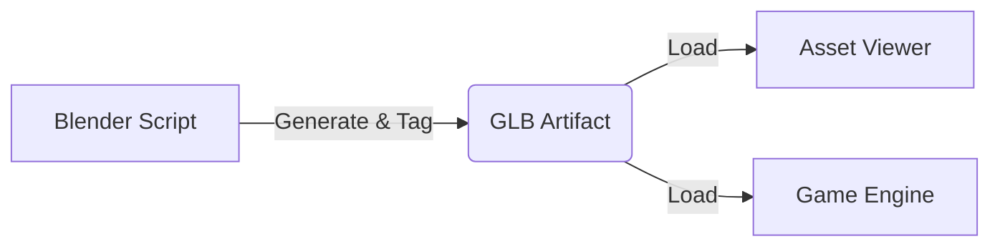

# DAMP Architecture & Rationale

**Distributed Asset & Material Pipeline (DAMP)**

This document outlines the architectural decisions and "Explicit Contract" model that governs the asset pipeline for the Gem Miner project.

## 1. Core Philosophy: "Explicit > Implicit"

The primary design principle is **Explicit Contracts**. We avoid "Implicit Logic" (guessing mesh names like `Cube001`, assuming default alignments, or relying on runtime discovery).

### The Contract Model

- **Blender (Provider)**: Explicitly tags Materials and Objects with a permanent `damp_id` custom property.
- **GLB (Artifact)**: Carries these IDs in the standard `extras` or `userData` fields.
- **Renderer (Consumer)**: Strictly enforces the contract. It looks for `damp_id` and maps functionality to it.

!!! failure "Implicit Logic (Bad)"
    Searching for mesh names like `Cube001` or `Cylinder` is fragile because Blender often renames things automatically.

!!! success "Explicit Contract (Good)"
    The renderer only cares about `damp_id="chassis"`. The geometry name can be anything.

## 2. The "Four Pillars" Structure

To maintain separation of concerns, the codebase is divided into four distinct domains:

1.  **`src/` (Game Source)**: The runtime game logic. It consumes assets but does not generate them.
2.  **`pipeline/` (Asset Factory)**: The "Source of Truth" for assets. Contains Blender Python scripts and procedural texture generators.
3.  **`tools/` (DX Tools)**: Developer tools like the Asset Viewer (`tools/viewer`) that verify assets in isolation.
4.  **`assets/` (Output/Artifacts)**: The compiled `.glb` and configuration files.

## 3. Pipeline Flow

The asset generation flow is automated via `task build:assets`:

1.  **Generation**: `pipeline/blender/bulldozer.py` generates geometry, parents objects, injects `damp_id`, and **bakes transforms**.
2.  **Compilation**: Exports a `.glb` and updates `catalog.json`.
3.  **Consumption**: `BulldozerRenderer` loads the GLB and applies materials based on IDs.

## 4. Key Architectural Decisions (Rationale)

### A. Parenting vs. Joining
!!! quote "Decision"
    Use Object Parenting, not `bpy.ops.object.join()`.

**Rationale**: Joining meshes destroys object-level metadata and forces Three.js to split primitives at runtime, causing race conditions and losing the `damp_id` on sub-parts. Parenting preserves the logical hierarchy and metadata.

### B. Material-Level Tagging
!!! quote "Decision"
    Tag Materials (`mat["damp_id"]`) in addition to Objects.

**Rationale**: Custom properties on Materials are more resilient. Even if geometry is merged or instanced, Three.js preserves material slots, allowing the renderer to reliably identify "Glass" vs "Steel" parts.

### C. Baked Transforms
!!! quote "Decision"
    Bake scale and rotation in Blender; avoid runtime adjustments.

**Rationale**: Early iterations attempted to fix rotation (Y-up vs Z-up) in JavaScript. This led to "Tiny Bodies and Giant Tracks" bugs. Baking the transforms ensures that `(1,1,1)` in the game engine matches the intended visual size.

### D. Centralized Utilities
!!! quote "Decision"
    Move cache-busting (`cb()`) and common logic to `src/utils/graphics-utils.js`.

**Rationale**: Previously, the Viewer and the Game had separate utility implementations, leading to "ghost bugs" where one saw cached assets and the other saw new ones. A shared utility ensures consistency.

## 5. Component Lifecycle

The standard lifecycle for an asset-based entity (like the Bulldozer) is:

1.  **`init()`**: Physics body created (invisible).
2.  **`load()`**: `BulldozerRenderer` fetches the GLB.
3.  **`setup()`**:
    - Traverses GLB.
    - Identifies Tracks (extracts Curves).
    - Identifies Chassis/Parts (applies Materials).
4.  **`update()`**: Syncs the root Mesh position/rotation to the Physics Body.

______________________________________________________________________
*Last Updated: 2025-05-19*
