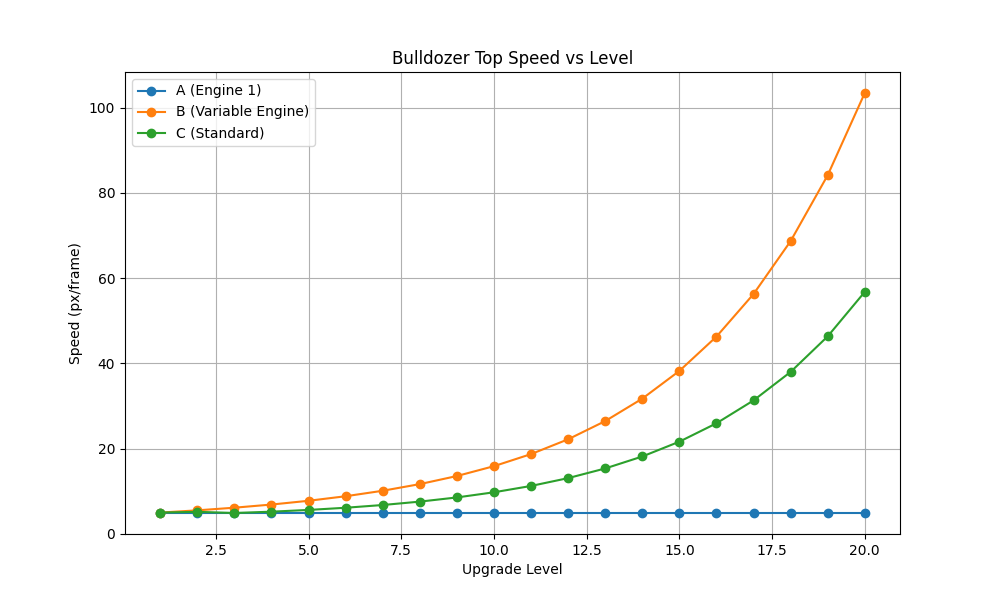

# Progression Analysis (Current State)

!!! info "Metadata"
    -   **Date:** 2026-01-13
    -   **Version:** 1.6 (Verified Logic)
    -   **Scope:** Current values for costs, entity stats, and economy.

!!! abstract "Context"
    This document outlines the current mathematical models governing the game's progression, including upgrade costs, entity scaling, and economic availability.

## 1. Economy (Gems)

The game world is divided into three zones. Gems are the sole source of currency.

| Zone | Gems | Value Range | Avg Value | Zone Total (Approx) | Unlock Condition |
| :--- | :--- | :--- | :--- | :--- | :--- |
| **1** | 400 | 8 - 12 | 10 | $4,000 | Start |
| **2** | 400 | 25 - 40 | 32.5 | $13,000 | 50% of Zone 1 Collected |
| **3** | 400 | 60 - 100 | 80 | $32,000 | 50% of Zone 2 Collected |
| **Total**| **1200** | | | **~$49,000** | |

## 2. Upgrade Costs

All upgrades follow a simple exponential growth curve: `NewCost = floor(OldCost * 1.5)`.

| Upgrade | Base Cost | Growth | Cost @ Lvl 5 | Cost @ Lvl 10 |
| :--- | :--- | :--- | :--- | :--- |
| **Engine** | 100 | x1.5 | 506 | 3,844 |
| **Plow** | 100 | x1.5 | 506 | 3,844 |
| **Collector** | 150 | x1.5 | 759 | 5,766 |

## 3. Entity Scaling Verification

### Performance Curves

The following chart illustrates the Top Speed scaling across three scenarios:
1.  **Standard:** All upgrades (Engine, Plow, Collector) kept equal.
2.  **Engine Focus:** Level 1 Plow/Collector, upgrading only Engine (Set B).
3.  **Engine Lag:** Level 1 Engine, upgrading Collector (Set A) (Note: Collector upgrades do not impact physics mass, so this line is flat).

### Wingtip Offsets (Plow Width Scaling)

As the plow upgrades (Level 3+), "wings" are added. The table below shows the offset of the wingtip relative to the main plow edge.

| Level | Wingtip Offset (units) |
| :--- | :--- |
| 1-2 | 0.00 |
| 3 | 28.83 |
| 5 | 36.79 |
| 10 | 56.70 |
| 20 | 96.53 |

**Observations (Post-Fix):**
-   **Baseline Improvement:** Starting speed is now ~5.0 px/f (vs ~2.9), making the base bulldozer feel more responsive.
-   **Progression Gap:** The Level 3 "Dip" has been significantly mitigated.
-   **Late Game:** Speed scales aggressively (up to ~56 px/f at Lvl 20), delivering the requested "Power Fantasy".

### Implemented Logic
`Force = (0.012 * 1.35^Level) + (Mass * 0.001)`

-   **Base Power:** Increased exponent from 1.25 to 1.35.
-   **Mass Compensation:** Added `Mass * 0.001` to force calculation.
