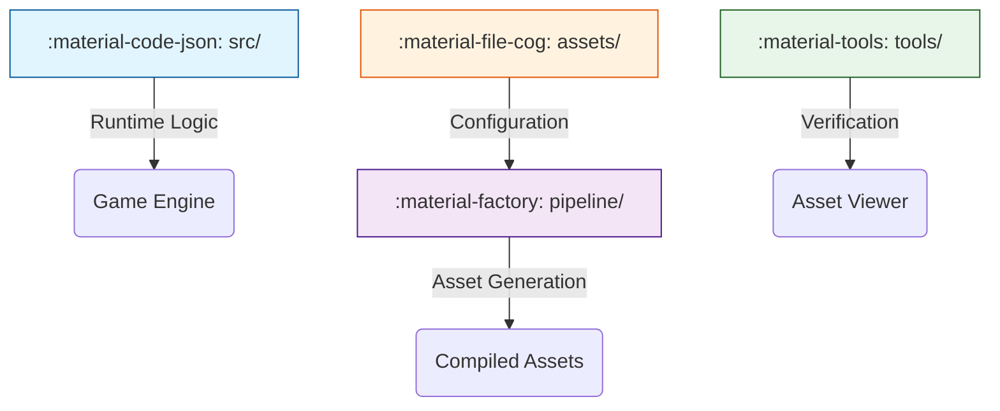
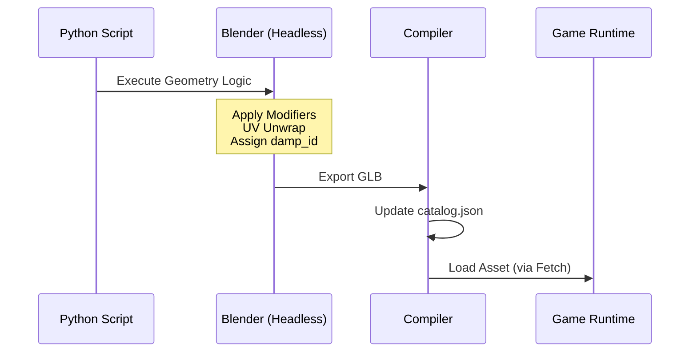

# Architecture Overview

!!! abstract ":material-map-marker-path: Roadmap"

    This document outlines the high-level structure of the Gem Miner codebase and the philosophy behind the "Distributed Asset & Material Pipeline" (DAMP).

## 🏛 The Four Pillars

To ensure maintainability and strict separation of concerns, the project is divided into four distinct domains.

### 1. :material-code-json: Game Source (`src/`)

The **Runtime Application**. This is the standard ES6 JavaScript game code.
It follows a strict rule: **It consumes assets, it never generates them.**

- **Core**: `src/core/` (Physics, Graphics, UI, Input)
- **Entities**: `src/entities/` (Bulldozer, Gems, Map)

### 2. :material-factory: Pipeline (`pipeline/`)

The **Asset Factory**. This is the "Source of Truth" for all visual content.
Unlike traditional workflows where artists push binary `.blend` files, we define assets as **Python Scripts**.

- **Blender Scripts**: `pipeline/blender/` (Geometry generation)
- **Texture Scripts**: `pipeline/textures/` (Procedural texture generation)

### 3. :material-tools: Developer Tools (`tools/`)

Standalone applications for verification and debugging.

- **Asset Viewer**: `tools/viewer/` (A dedicated app to inspect GLBs and Material Contracts)
- **Physics Playground**: `tools/physics-playground/` (Headless physics tuning)

### 4. :material-file-cog: Asset Configuration (`assets/`)

Input data and configuration files.

- **Contracts**: `assets/configs/` (JSON files defining material properties)
- **Reference**: `assets/source/` (Reference images or data)

---

## 🔄 The Pipeline Flow

The build process transforms Python scripts into optimized GLTF artifacts.

1.  **Generation**: `task build:assets` runs Blender in the background.
2.  **Tagging**: Scripts inject a `damp_id` custom property into meshes and materials.
3.  **Compilation**: The compiler generates a `.glb` file and updates the `catalog.json` index.
4.  **Runtime**: The game fetches the GLB and applies materials based on the **Explicit Contract** (see [DAMP Strategy](DAMP.md)).
